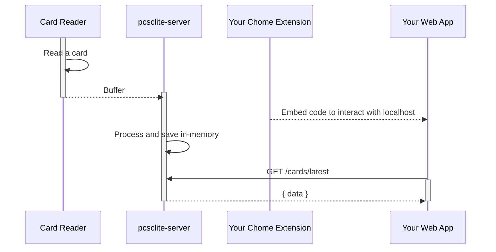

# PCSC Lite Server

This server can be deployed on a device connected with a smartcard reader. It will provide a web server serving with the latest card information it read.

## Security

It should be used with a Chrome Extension which provide a service worker embeded a piece of code to interact with the local pcsclite-server. You should implement a security layer between the pcsclite-server and your Chrome Extension so to prevent malicious actor in your network.

## Implementation



## Usage

```ts
import { initializePcsc, createServer } from 'pcsclite-server';

const server = createServer();

// Modify Fastify server instance as needed
// Then initialize pcsclite using the server instance
initializePcsc(server);

```
